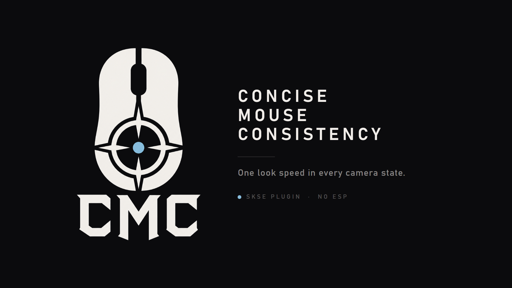
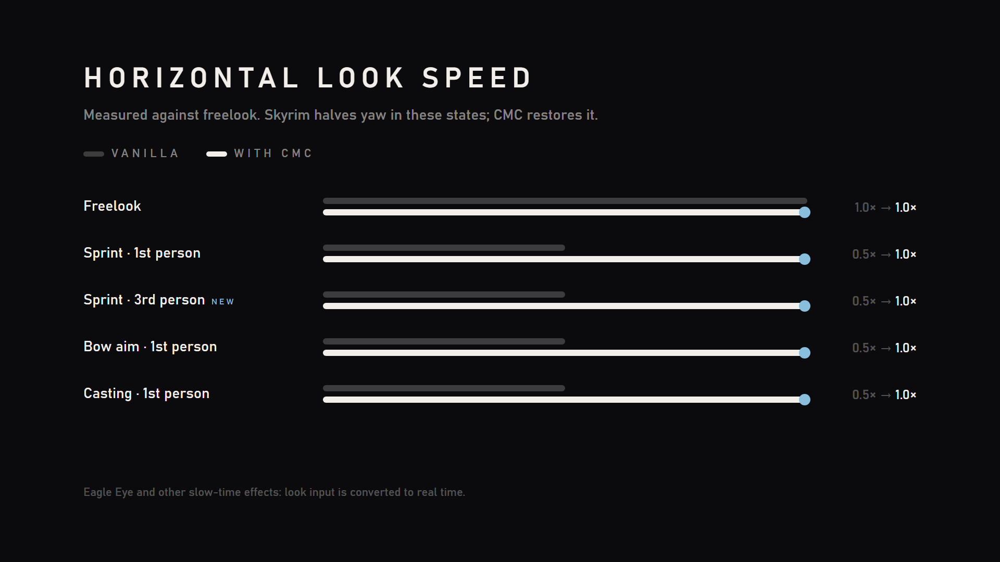
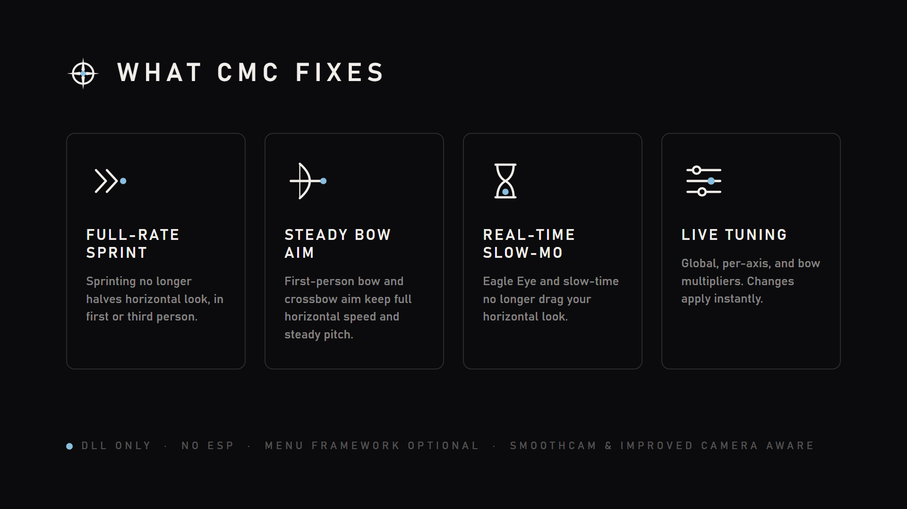
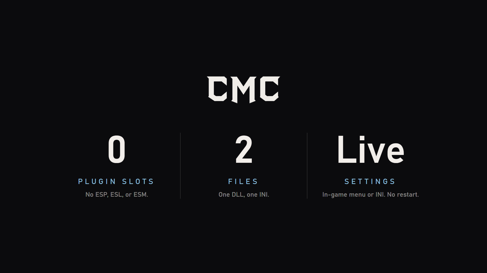
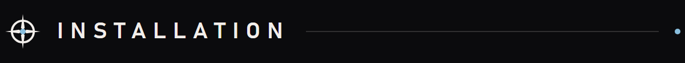
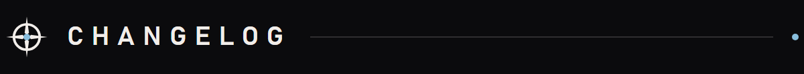
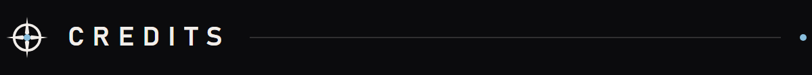

# CMC Press Kit

Art and copy for the **Concise Mouse Consistency (CMC)** Nexus page. Everything here is loose files. Nothing is zipped.


## Copy-paste text

| File | Paste into |
|---|---|
| [`nexus-description.bbcode.txt`](nexus-description.bbcode.txt) | Nexus **Description** field (BBCode). Images load from this repo's `main` branch. |
| [`nexus-summary.txt`](nexus-summary.txt) | Nexus **Brief overview** (under 255 characters) |

## Nexus page images

Upload these on the Nexus **Images** tab. Make the primary image the mod's **Primary image**.

| Image | Size | Use |
|---|---|---|
| [`cmc-primary-1920x1080.png`](nexus/cmc-primary-1920x1080.png) | 1920×1080 | Primary image / thumbnail |
| [`cmc-gallery-look-speed-1920x1080.png`](nexus/cmc-gallery-look-speed-1920x1080.png) | 1920×1080 | Gallery: vanilla vs CMC look speed |
| [`cmc-gallery-features-1920x1080.png`](nexus/cmc-gallery-features-1920x1080.png) | 1920×1080 | Gallery: what CMC fixes |
| [`cmc-gallery-at-a-glance-1920x1080.png`](nexus/cmc-gallery-at-a-glance-1920x1080.png) | 1920×1080 | Gallery: no ESP, two files, live settings |
| [`cmc-header-1920x480.png`](nexus/cmc-header-1920x480.png) | 1920×480 | Description banner / page header |

<p>
  
  
  
  
</p>

## Description section headers

The BBCode file already uses these. They are 1200×112, plus a 1200×48 divider.










## Logo files

| File | Notes |
|---|---|
| [`logo/cmc-logo-1254.png`](logo/cmc-logo-1254.png) | Original minimal logo on black |
| [`logo/cmc-logo-512.png`](logo/cmc-logo-512.png), [`logo/cmc-logo-256.png`](logo/cmc-logo-256.png) | Avatar / icon sizes |
| [`logo/cmc-logo-transparent.png`](logo/cmc-logo-transparent.png) | Full logo, transparent background |
| [`logo/cmc-emblem-transparent.png`](logo/cmc-emblem-transparent.png) | Mouse and reticle only |
| [`logo/cmc-wordmark-transparent.png`](logo/cmc-wordmark-transparent.png) | "CMC" lettering only |

The transparent files are light artwork. Place them only on dark backgrounds.

## Style

| Token | Value | Use |
|---|---|---|
| Background | `#0b0b0d` | Every canvas |
| Foreground | `#f2eeea` | Logo, headings, body text (55% opacity for secondary text) |
| Accent | `#89bedd` | Reticle dot. Use it for one detail per image at most. |
| Type | Bahnschrift (Windows) | Uppercase headings with wide letter spacing |

Keep it flat: no gradients, glows, textures, or extra colors. The reticle mark in the section headers is redrawn from the logo.

## Rebuild

Requires Windows, Python 3 with Pillow, and Microsoft Edge.

```powershell
python presskit/src/cutout.py   # logo/ cutouts from assets/cmc-nexus-logo-v2-minimal.png
python presskit/src/build.py    # nexus/ images rendered with headless Edge
```

Image copy lives in `presskit/src/build.py`. Change the text there, rebuild, and commit the PNGs. Nexus loads the description images from `main`.
